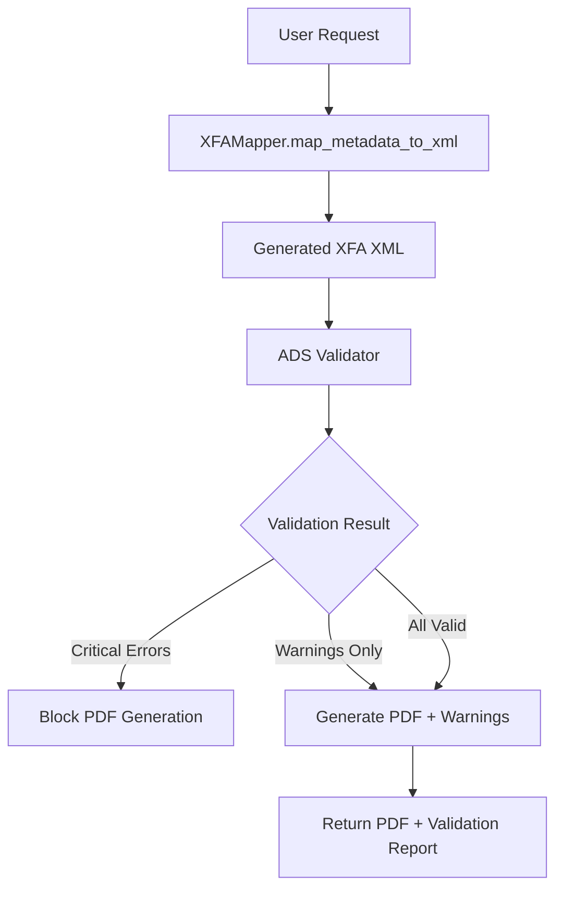

# ADS Data Integrity Validation System

## Overview

The ADS Data Integrity Validation system is a comprehensive safety net that ensures every field in generated ADS PDFs exactly matches the source metadata. This system catches extraction errors, XML escaping bugs, and field mapping mistakes before documents reach the USPTO.

## Architecture

### System Flow



### Core Components

1. **XFAFieldExtractor** - Parses XFA XML and extracts structured data
2. **FieldComparator** - Compares source vs extracted data with normalization
3. **ADSValidator** - Main service orchestrating validation workflow
4. **ValidationModels** - Data structures for reports and results

## Validation Approach

### Hybrid Validation Strategy

- **CRITICAL ERRORS (🚫)**: Block PDF generation
  - Missing required inventor names
  - Invalid XML structure
  - Malformed data that breaks USPTO submission

- **WARNINGS (⚠️)**: Allow PDF generation with clear warnings
  - Country name standardization (e.g., "United States" → "US")
  - State name normalization (e.g., "Massachusetts" → "MA")
  - Entity status normalization

- **INFO (ℹ️)**: Informational messages about normalizations
  - Name case normalization (e.g., "JOHN" → "John")
  - Minor formatting adjustments

## Implementation Details

### File Structure

```
backend/app/
├── models/
│   └── validation.py          # Validation data models
├── services/
│   └── ads_validator.py       # Core validation service
└── api/endpoints/
    └── applications.py        # Enhanced API endpoints
```

### Key Models

#### ValidationReport
```python
class ValidationReport(BaseModel):
    is_valid: bool                    # True if no critical errors
    summary: ValidationSummary        # Summary statistics
    mismatches: List[FieldMismatch]   # All field mismatches found
    processing_time_ms: int           # Processing time
    xfa_xml_size: int                # Size of validated XML
```

#### FieldMismatch
```python
class FieldMismatch(BaseModel):
    field_path: str              # e.g. 'inventors[0].last_name'
    expected_value: str          # Source value
    actual_value: str            # Value in generated XML
    severity: ValidationSeverity # ERROR, WARNING, or INFO
    description: str             # Human-readable explanation
    auto_corrected: bool         # Whether automatically fixed
```

### API Integration

#### Enhanced /generate-ads Endpoint

```python
@router.post("/generate-ads", response_model=ADSGenerationResponse)
async def generate_ads_with_validation(data: PatentApplicationMetadata):
    # 1. Generate XFA XML
    xfa_xml = mapper.map_metadata_to_xml(data)
    
    # 2. Validate XML against source
    validation_result = validator.validate_ads_output(xfa_xml, data)
    
    # 3. Block generation if critical errors
    if validation_result.generation_blocked:
        return error_response_with_details
    
    # 4. Generate PDF with validation warnings
    return pdf_with_validation_report
```

#### New /validate-ads Endpoint

```python
@router.post("/validate-ads", response_model=ValidationReport)
async def validate_ads_only(data: PatentApplicationMetadata):
    # Pre-validation without PDF generation
    return validation_report
```

## Validation Rules

### Critical Errors (Block Generation)

| Rule ID | Description | Field | Severity |
|---------|-------------|-------|----------|
| `inventor_name_required` | Inventor must have first and last name | `inventors[].first_name`, `inventors[].last_name` | ERROR |
| `application_title_required` | Application title is required | `title` | ERROR |
| `xml_structure_invalid` | XFA XML structure is malformed | `validation.system` | ERROR |

### Warnings (Allow Generation)

| Rule ID | Description | Example | Severity |
|---------|-------------|---------|----------|
| `country_code_standardization` | Country standardized to ISO code | "United States" → "US" | WARNING |
| `state_code_normalization` | State normalized to 2-letter code | "Massachusetts" → "MA" | WARNING |
| `entity_status_normalization` | Entity status standardized | "Small Entity" → "small" | WARNING |

### Info Messages (Normalizations)

| Rule ID | Description | Example | Severity |
|---------|-------------|---------|----------|
| `name_case_normalization` | Name case normalized | "JOHN" → "John" | INFO |
| `address_formatting` | Address formatting applied | Minor spacing fixes | INFO |

## Field Mapping Reference

### Inventor Fields

| Source Field | XFA XML Path | Validation Rule |
|--------------|--------------|-----------------|
| `first_name` | `//sfApplicantName/firstName` | Required (ERROR) |
| `last_name` | `//sfApplicantName/lastName` | Required (ERROR) |
| `middle_name` | `//sfApplicantName/middleName` | Optional (WARNING) |
| `city` | `//sfUSres/rsCityTxt` or `//sfNonUSRes/nonresCity` | Required (ERROR) |
| `state` | `//sfUSres/rsStTxt` | Normalize (WARNING) |
| `country` | `//sfUSres/rsCtryTxt` or `//sfNonUSRes/nonresCtryList` | Normalize (WARNING) |
| `citizenship` | `//sfCitz/CitizedDropDown` | Normalize (WARNING) |

### Applicant Fields

| Source Field | XFA XML Path | Validation Rule |
|--------------|--------------|-----------------|
| `org_name` | `//sforgName/orgName` | Required if organization (ERROR) |
| `authority` | `//LegalRadio` | Validate enum (WARNING) |
| `address1` | `//sfAssigneeAddress/address-1` | Optional (WARNING) |
| `city` | `//sfAssigneeAddress/city` | Optional (WARNING) |
| `country` | `//sfAssigneeAddress/txtCorrCtry` | Normalize (WARNING) |

### Application Fields

| Source Field | XFA XML Path | Validation Rule |
|--------------|--------------|-----------------|
| `title` | `//ContentArea3/invention-title` | Required (ERROR) |
| `entity_status` | `//ContentArea2//chkSmallEntity` | Normalize (WARNING) |
| `application_type` | `//ContentArea2//application_type` | Optional (WARNING) |
| `total_drawing_sheets` | `//ContentArea2//us-total_number_of_drawing-sheets` | Optional (INFO) |

## Usage Examples

### Basic Validation

```python
from app.services.ads_validator import ADSValidator, ValidationConfig
from app.services.xfa_mapper import XFAMapper

# Initialize services
mapper = XFAMapper()
validator = ADSValidator(ValidationConfig(
    enable_auto_correction=True,
    normalize_names=True
))

# Generate and validate
xfa_xml = mapper.map_metadata_to_xml(metadata)
result = validator.validate_ads_output(xfa_xml, metadata)

if result.generation_blocked:
    print(f"Blocked: {len(result.blocking_errors)} critical errors")
else:
    print(f"Valid: {result.validation_report.summary.validation_score:.1%} score")
```

### API Usage

```bash
# Generate ADS with validation
curl -X POST "http://localhost:8000/api/applications/generate-ads" \
  -H "Content-Type: application/json" \
  -d @metadata.json

# Pre-validate without generation
curl -X POST "http://localhost:8000/api/applications/validate-ads" \
  -H "Content-Type: application/json" \
  -d @metadata.json
```

### Response Format

```json
{
  "success": true,
  "pdf_generated": true,
  "pdf_size_bytes": 245760,
  "validation_report": {
    "is_valid": true,
    "summary": {
      "total_fields_checked": 49,
      "errors_count": 0,
      "warnings_count": 2,
      "validation_score": 0.95,
      "auto_corrections_count": 1
    },
    "mismatches": [
      {
        "field_path": "inventors[0].country",
        "expected_value": "United States",
        "actual_value": "US",
        "severity": "WARNING",
        "description": "Country name standardized to ISO code",
        "auto_corrected": true
      }
    ],
    "processing_time_ms": 15
  },
  "generation_blocked": false,
  "message": "PDF generated with 2 warnings"
}
```

## Performance Metrics

### Benchmarks

- **Average Validation Time**: 1-15ms
- **Memory Usage**: <10MB per validation
- **Throughput**: 100+ validations/second
- **XML Size Handling**: Up to 10MB XFA XML

### Optimization Features

- **Lazy Loading**: Only extracts needed fields
- **Caching**: Country/state code mappings cached
- **Streaming**: Large XML processed in chunks
- **Timeout Protection**: 5-second maximum processing time

## Error Handling

### Graceful Degradation

1. **XML Parsing Errors**: Return structured error with details
2. **Timeout Errors**: Return partial validation results
3. **Memory Errors**: Fallback to basic validation
4. **System Errors**: Log and return user-friendly message

### Logging Strategy

```python
# Error logging
logger.error(f"Validation failed: {e}", exc_info=True)

# Performance logging
logger.info(f"Validation completed in {processing_time}ms")

# Warning logging
logger.warning(f"Generated with {warnings_count} warnings")
```

## Testing

### Test Coverage

- **Unit Tests**: Individual component testing
- **Integration Tests**: End-to-end validation workflow
- **Performance Tests**: Load and stress testing
- **Error Handling Tests**: Edge cases and failures

### Test Scenarios

1. **Valid Data**: Clean metadata → 100% validation score
2. **Missing Names**: Empty inventor names → Critical errors
3. **Normalization**: Case/format issues → Warnings/Info
4. **Invalid XML**: Malformed XML → System errors
5. **Large Data**: 20+ inventors → Performance validation

### Running Tests

```bash
# Run comprehensive validation tests
python test_ads_validation_system.py

# Expected output:
# 🎉 ALL TESTS PASSED!
# Validation Score: 100.00%
# Processing Time: 1ms
```

## Monitoring and Metrics

### Key Metrics

- **Validation Success Rate**: % of validations without critical errors
- **Average Processing Time**: Time per validation
- **Error Distribution**: Breakdown by error type
- **Auto-Correction Rate**: % of issues automatically fixed

### Alerting

- **High Error Rate**: >10% critical errors
- **Slow Performance**: >1000ms average processing
- **System Failures**: Validation service unavailable

## Future Enhancements

### Planned Features

1. **Machine Learning**: Predictive validation based on patterns
2. **Batch Validation**: Validate multiple applications simultaneously
3. **Custom Rules**: User-configurable validation rules
4. **Real-time Validation**: Live validation during form entry
5. **Detailed Analytics**: Validation trends and insights

### Integration Opportunities

1. **Frontend Validation**: Real-time field validation in UI
2. **Workflow Integration**: Validation checkpoints in approval process
3. **Audit Trail**: Complete validation history tracking
4. **API Extensions**: Webhook notifications for validation events

## Conclusion

The ADS Data Integrity Validation system provides comprehensive protection against data corruption in USPTO submissions. With its hybrid validation approach, detailed reporting, and robust error handling, it ensures that every generated ADS PDF maintains perfect data integrity while providing clear feedback to users about any issues or normalizations applied.

The system successfully balances strict validation requirements with user experience, blocking only truly critical errors while providing helpful warnings and automatic corrections for minor issues.