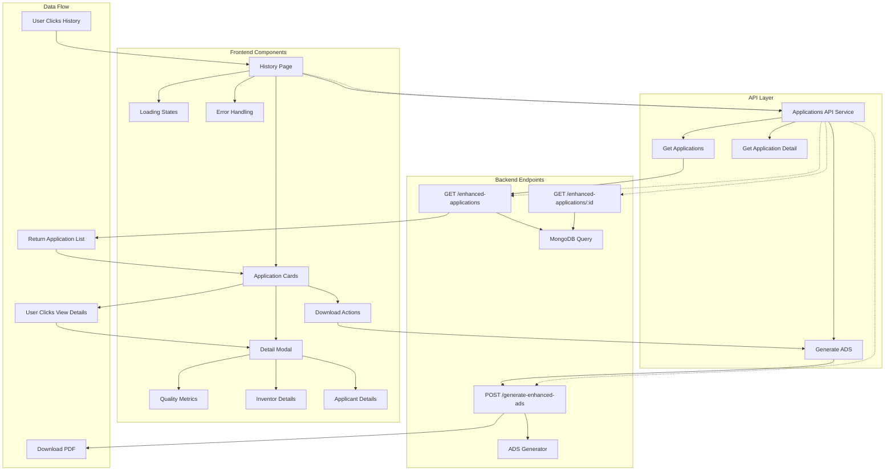
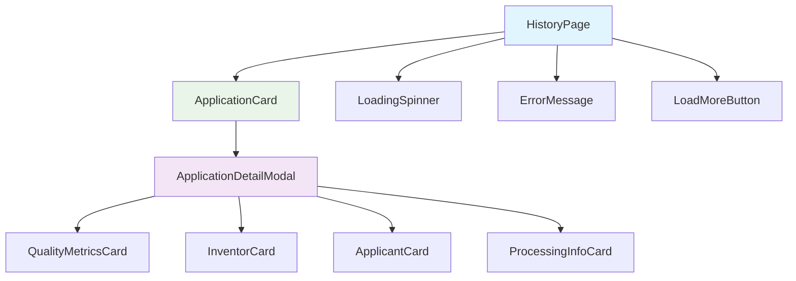

# History Tab Implementation Plan

## Overview
This document outlines the complete implementation plan for making the history tab functional, showing processed applications with basic info and detailed view capabilities.

## Current State Analysis

### Backend API Available
- **Endpoint**: `GET /enhanced-applications`
- **Authentication**: Requires user authentication
- **Pagination**: Supports `skip` and `limit` parameters
- **Response**: Returns array of enhanced application objects

### Frontend Current State
- History page exists at `frontend/src/app/(dashboard)/dashboard/history/page.tsx`
- Currently shows empty state with "No history yet" message
- Navigation is properly configured in sidebar

## Implementation Steps

### 1. Add TypeScript Interfaces to `frontend/src/lib/types.ts`

Add the following interfaces to support the enhanced application data structure:

```typescript
// Enhanced Application History Types
export interface QualityMetrics {
  completeness_score: number;
  accuracy_score: number;
  confidence_score: number;
  consistency_score: number;
  overall_quality_score: number;
  required_fields_populated: number;
  total_required_fields: number;
  optional_fields_populated: number;
  total_optional_fields: number;
  validation_errors: number;
  validation_warnings: number;
}

export interface ExtractionMetadata {
  extraction_method: string;
  document_type: string;
  processing_time: number;
  llm_tokens_used?: number;
  fallback_level_used?: string;
  manual_review_required: boolean;
  extraction_notes: string[];
}

export interface EnhancedInventor {
  given_name?: string;
  middle_name?: string;
  family_name?: string;
  full_name?: string;
  street_address?: string;
  address_line_2?: string;
  city?: string;
  state?: string;
  postal_code?: string;
  country?: string;
  citizenship?: string;
  sequence_number?: number;
  completeness: string;
  confidence_score: number;
}

export interface EnhancedApplicant {
  is_assignee: boolean;
  organization_name?: string;
  individual_given_name?: string;
  individual_family_name?: string;
  street_address?: string;
  address_line_2?: string;
  city?: string;
  state?: string;
  postal_code?: string;
  country?: string;
  customer_number?: string;
  email_address?: string;
  phone_number?: string;
  relationship_to_inventors: string;
  legal_entity_type?: string;
  completeness: string;
  confidence_score: number;
}

export interface PriorityClaimInfo {
  application_number: string;
  filing_date: string;
  country?: string;
  continuity_type?: string;
  confidence_score: number;
}

export interface ApplicationHistoryItem {
  _id: string;
  title?: string;
  application_number?: string;
  filing_date?: string;
  entity_status?: string;
  attorney_docket_number?: string;
  confirmation_number?: string;
  application_type?: string;
  inventors: EnhancedInventor[];
  applicants: EnhancedApplicant[];
  correspondence_info?: CorrespondenceInfo;
  attorney_agent_info?: AttorneyAgentInfo;
  domestic_priority_claims: PriorityClaimInfo[];
  foreign_priority_claims: PriorityClaimInfo[];
  classification_info?: ClassificationInfo;
  quality_metrics: QualityMetrics;
  extraction_metadata: ExtractionMetadata;
  manual_review_required: boolean;
  extraction_warnings: string[];
  recommendations: string[];
  created_by: string;
  created_at: string;
  workflow_status: string;
}
```

### 2. Create API Service Functions

Create `frontend/src/lib/api/applications.ts`:

```typescript
import api from '@/lib/axios';
import { ApplicationHistoryItem } from '@/lib/types';

export interface GetApplicationsParams {
  skip?: number;
  limit?: number;
}

export const applicationsApi = {
  // Get list of applications for current user
  getApplications: async (params: GetApplicationsParams = {}) => {
    const { skip = 0, limit = 20 } = params;
    const response = await api.get<ApplicationHistoryItem[]>('/enhanced-applications', {
      params: { skip, limit }
    });
    return response.data;
  },

  // Get specific application by ID
  getApplication: async (applicationId: string) => {
    const response = await api.get<ApplicationHistoryItem>(`/enhanced-applications/${applicationId}`);
    return response.data;
  },

  // Generate ADS for an application
  generateADS: async (applicationData: ApplicationHistoryItem) => {
    const response = await api.post('/generate-enhanced-ads', applicationData, {
      responseType: 'blob'
    });
    return response.data;
  }
};
```

### 3. Update History Page Component

Replace the content of `frontend/src/app/(dashboard)/dashboard/history/page.tsx` with a functional history list that:
- Fetches applications from the API
- Displays them in a card layout
- Shows loading and error states
- Includes pagination
- Provides view details and download actions

### 4. Create Application Detail Modal

Create `frontend/src/components/history/ApplicationDetailModal.tsx` to show:
- Complete application information
- Quality metrics visualization
- Inventor and applicant details
- Processing information
- Download functionality

### 5. Key Features to Implement

#### History List Features:
- **Card-based layout** showing application summary
- **Quality badges** indicating extraction quality
- **Status indicators** for review requirements
- **Quick actions** (View Details, Download ADS)
- **Responsive design** for mobile and desktop
- **Pagination** with "Load More" functionality
- **Loading states** and error handling

#### Detail Modal Features:
- **Comprehensive application info** display
- **Quality metrics** with visual indicators
- **Inventor/Applicant details** in organized sections
- **Processing metadata** and warnings
- **Download ADS** functionality
- **Responsive modal** design

#### Data Display Elements:
- Application title and number
- Filing date and attorney docket number
- Inventor count and names
- Applicant information
- Quality score with color coding
- Manual review flags
- Processing timestamps

### 6. UI/UX Considerations

#### Design Consistency:
- Use existing UI components (Card, Button, Badge)
- Follow current color scheme and typography
- Maintain consistent spacing and layout patterns
- Use Lucide icons for visual elements

#### User Experience:
- Clear visual hierarchy in application cards
- Intuitive quality score representation
- Easy access to detailed information
- Smooth loading states and transitions
- Error handling with retry options

#### Responsive Design:
- Mobile-first approach
- Collapsible information on smaller screens
- Touch-friendly button sizes
- Readable text at all screen sizes

### 7. Error Handling Strategy

- **Network errors**: Show retry button with clear error message
- **Empty states**: Friendly message encouraging first application
- **Loading states**: Skeleton loading or spinner indicators
- **API errors**: Display specific error messages from backend
- **Download errors**: Toast notifications for failed downloads

### 8. Performance Considerations

- **Pagination**: Load applications in chunks (10-20 per page)
- **Lazy loading**: Load more on demand rather than all at once
- **Caching**: Consider caching application list data
- **Optimistic updates**: Show immediate feedback for user actions

## Implementation Priority

1. **High Priority**: Basic list view with application cards
2. **High Priority**: API integration and data fetching
3. **Medium Priority**: Detail modal with comprehensive information
4. **Medium Priority**: Download ADS functionality
5. **Low Priority**: Advanced filtering and search capabilities

## Testing Strategy

1. **Unit Tests**: Test API service functions
2. **Integration Tests**: Test component interactions
3. **User Testing**: Verify usability of history interface
4. **Performance Testing**: Ensure smooth loading with many applications

## Future Enhancements

- Search and filter functionality
- Bulk operations (delete, download multiple)
- Export capabilities (CSV, Excel)
- Application comparison features
- Advanced sorting options

## Architecture Overview



## Component Hierarchy


